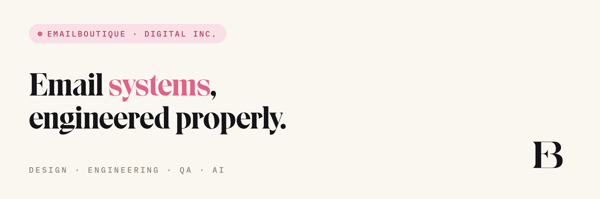

<!-- Commit to the org's .github repo at: profile/README.md
     Put both banners in the SAME folder: profile/eb-github-header-light.png and profile/eb-github-header-dark.png -->

<a href="https://www.emailboutique.io">
  <picture>
    <source media="(prefers-color-scheme: dark)" srcset="./eb-github-header-dark.png">
    <source media="(prefers-color-scheme: light)" srcset="./eb-github-header-light.png">
    
  </picture>
</a>

<a href="https://www.emailboutique.io"><strong>emailboutique.io</strong></a>
&nbsp; · &nbsp;
<a href="https://www.annettforcier.com"><strong>annettforcier.com</strong></a>

&nbsp;

&nbsp;

<h2>Email systems, engineered properly.</h2>

<strong>EmailBoutique Digital Inc.</strong> is an independent email design and engineering studio founded by <a href="https://www.annettforcier.com">Annett Forcier</a>. We design, build, test and improve the systems behind email — design systems and modular templates, production tooling, QA, accessibility, dark mode, and AI-assisted workflows — so marketing teams get real control over how their email gets made.

This GitHub organization is the technical side of that work: the tools, experiments and references we build and share in the open.

<h2>What we do</h2>

<strong>Design systems</strong> — scalable systems in Figma, translated into production-ready email components. Not a folder of templates: one shared system that connects design, development and production.

<strong>Email engineering</strong> — responsive, accessible HTML built for the reality of inboxes: Outlook, Gmail, Apple Mail, mobile, dark mode, and all the things email developers have learned not to trust.

<blockquote>

<strong>ESPs</strong> — Marketo · Salesforce Marketing Cloud · Iterable · Braze · Klaviyo · HubSpot · Pardot 
<strong>Builders</strong> — Denada · BetterEmail · Stensul · Knak · BEE

</blockquote>

<strong>Quality systems</strong> — QA past "it looks right": HTML/CSS, accessibility, responsive behaviour, dark mode, links and tracking, image handling, email weight, client compatibility, production readiness — as a repeatable process, not one person's habit.

<strong>AI &amp; workflow</strong> — where AI genuinely fits professional email development. Not generating HTML and hoping: teaching AI the strange, highly specialized rules of production email, and building the instructions, checks and guardrails that make the output usable — with expert review on top.

<h2>What we're building</h2>

Selected tools, experiments and references from EmailBoutique's own work. MIT-licensed — use them, fork them, and tell us where they break.

<h3>🔬 email-html-qa-skill</h3>

Automated pre-send QA for HTML email, packaged as a Claude skill. It reads real email code and flags problems across rendering, dark mode, accessibility, links, images and production readiness — by severity.

It's a diagnostic by design. Detecting the problems is the part that automates well, so we automated it. Knowing how to <em>fix</em> a broken dark-mode gradient, a clipped Gmail render or an inaccessible layout is the harder, specialist half — and that's the studio's work.

<strong><a href="https://github.com/EmailBoutique-Digital-Inc/email-html-qa-skill">Explore email-html-qa-skill →</a></strong>

<h3>📸 email-screenshot-tool</h3>

Renders email HTML to clean, consistent screenshots for QA review and case-study documentation.

<strong><a href="https://github.com/EmailBoutique-Digital-Inc/email-screenshot-tool">Explore email-screenshot-tool →</a></strong>

<em>More tools and experiments are on the way.</em>

<h2>Systems you own, not emails you rent.</h2>

A good email system shouldn't make a team depend on the person who originally built it. We build systems designed to be understood, maintained, documented and run by the people who actually produce the email.

<pre><code>Figma → Design System → Components → HTML → ESP → QA → Documentation → Governance</code></pre>

The platforms change from one organization to the next. The principle doesn't.

<h2>About the founder</h2>

<strong>Hi, I'm Annett.</strong> 👋

I've worked in front-end development since 1999 and specialized in email design and development for more than a decade. My work sits somewhere between design systems, front-end engineering, email development, marketing operations and — increasingly — AI. I've helped teams across a lot of industries turn fragmented email production into systems designers, developers and marketers can actually work with.

EmailBoutique is where that work becomes a business. My personal site is where you can see more of the person and the work behind it.

<strong><a href="https://www.annettforcier.com">See more of the work → annettforcier.com</a></strong>

<h2>Work with us</h2>

Building a new email system, untangling an existing one, migrating platforms, or building an AI product that needs someone who genuinely understands email HTML? That's the studio's work.

<strong><a href="https://www.emailboutique.io">emailboutique.io →</a></strong> &nbsp;·&nbsp; welcome@emailboutique.io

<strong>EmailBoutique</strong> · Where email becomes a system. 
Built with curiosity, an unreasonable attention to email HTML, and probably too many browser tabs. 💌

